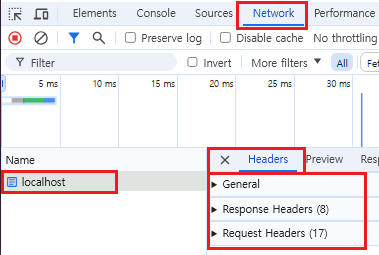

# 미들웨어

## bodyMiddleware

-  바디 정보는 가려져서 보이지 않고 헤더만 보임

예시

```diff
    <input type="text" name="name" >
    <input type="text" name="age" >
! name="설정값"
! 설정값이 각자의 key로써 작동
```




## errorMiddleware
- http의 에러코드 : 500