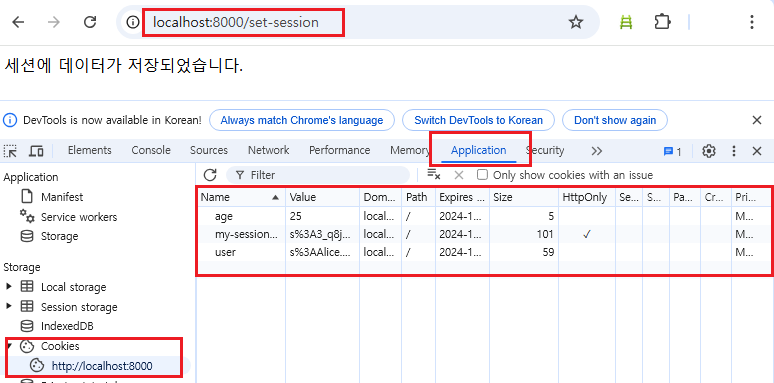

# express-session 미들웨어

-  쿠키 미들웨어 설치하기 `npm install cookie-parser`
-  미들웨어 설치하기 `npm install express-session`

```diff
+ const express = require('express')
+ const session = require('express-session')

! 세션 설정
app.use(
    session({
        name: 'my-session-cookie',
        secret: 'your secret-key',
        resave: false,
        
    })
)

```


